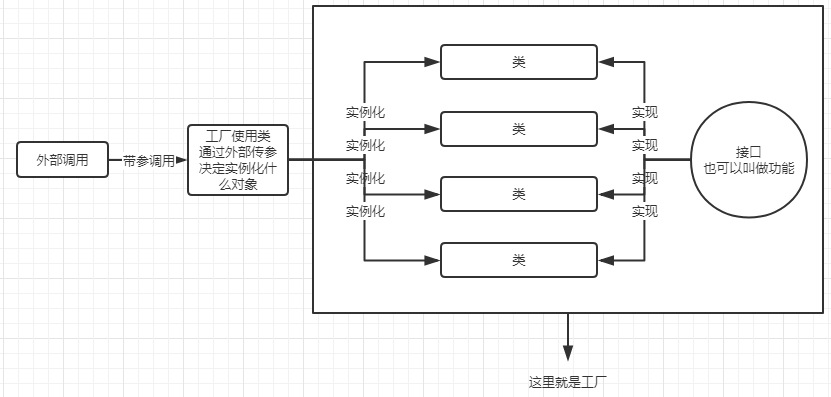
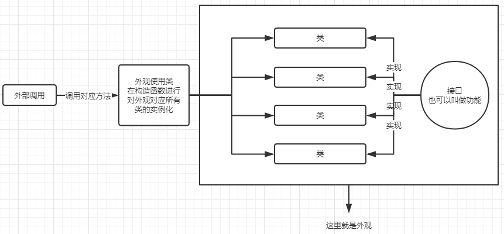
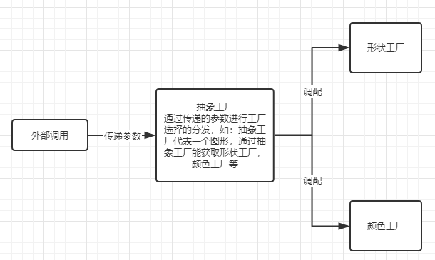
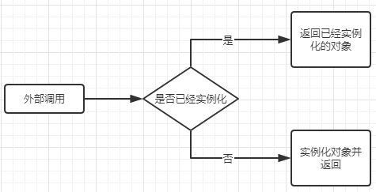
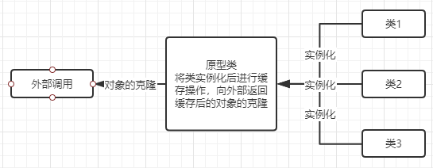
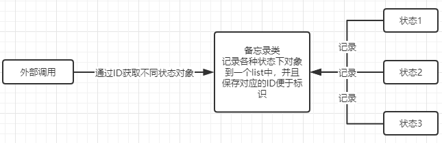

# 设计模式
---
##### 写在前面
在设计模式的分类中，将常见的设计模式分为创建型，结构型，行为型，和Sun公司规定的J2EE型。但这种分类模式多注重于按照实现方式分类，而我在理解设计模式时更加喜欢用模式的设计思想进行分类，如果有任何不同见解欢迎与我进行讨论或上传自己对设计模式的理解。

---
#### 我们为什么要用设计模式？
- 相信很多初学者和我一样，在初识设计模式的时候最大的一个疑惑就是，我为什么要用设计模式？因为在对技术进行初学的时候多为个人开发且项目的复杂程度有限，完全达不到采用设计模式的程度，就会产生一种感觉，就是明明可以直接解决的问题，偏偏要转个弯去解决，然而解决了之后实现的效果完全没有差别，从而产生了设计模式看起来很多余的想法。
但为何设计模式如此重要，归根结底就是两个字，解耦。

- 设计模式我个人的理解来看不是一种实现过程，例如多线程并发解决方案中goroutine的应用，类型转换中反射的应用，反之设计模式更偏向于一种解决问题的思想，是一种抽象化的概念。就好比汽车修理厂中，修理的工具和修理的方法是不同的。工具就是工具不会变，学徒工或是几十年的老师傅手中的钳子扳手也不会变成锤子斧子。但方法不同，或是说手法，在于对整个构造的理解和问题解决方面的多样性和经验，就是能力高低的区别。
- 对于程序设计也一样，举个简单的例子，在做数学题的时候对于一道题，用最简单的办法，提起笔硬加减乘除，只要时间够精力充足，结果的运算可以拓展到无限大，而怎么方便快捷且通用的做出一系列的题目，就是方法所带来的。
- 对于程序来说也一样，设计模式对于一系列的问题给出了一个通用化的解决方案，同时这种解决方案对于程序带来的直接受益就是大大的降低耦合度，设计模式旨在让程序之间互相的耦合度降低，将功能实现与实际运用尽可能分离，从而实现对于拓展、调用、多人协作问题的合理化和便捷化。前面已经提到过了设计模式是一种注重思想而非实现的东西，大家在看所有的设计模式的教程时，不要和直接实现对比我为什么要这么做，而是将关注点放在如果我这么做了会怎样，就会对设计模式有一个不同的理解。

---
#### 常用设计模式
以下均为主观分类，将看起来流程很相似但是本质不同的设计模式分为相同类别

---
1. 不同的类具有相同方法但实现方式又不同时
	- 工厂模式
	  顾名思义，工厂模式的思想在于将一系列具有相同功能的东西通过同一个入口进行创建。就像之前想要造车要去车厂，造船要去船厂，造飞机要去飞机厂，因为他们存在通性，都可以移动，所以现在我们创建了一个叫做可移动交通工具建造厂，这时候用户只需要来到来到交通工具建造厂，并告诉建造厂想要的交通工具名称，即可得到对应的东西了。这样的话就在需要不同的东西的时候不用到不同的地方获取。但工厂模式中的对象一定要有共性，有通用功能，用技术的语言讲就是实现了相同的接口。
	  
	
	- 外观模式
	  外观模式的实现流程上和工厂模式很像，都是将多个类绑定在一个入口类里面，外部通过调用入口类实现功能。但看起来很像却本质完全不同，工厂模式注重于通过不同的名字对不同的类做实例化，而外观模式则是注重于对不同的类的方法进行调用。换句话来说工厂模式是调用工厂时进行判定并实例化，而外观模式是在外观中进行对象实例化，向外部展示的是实例化后的类对应的方法。用现实生活中的抽象理解就是，如果你去工厂要一辆自行车，这辆自行车还只有概念没有实物，需要工厂创建一个实物给你。而如果你能够看到一辆自行车的外观，前提是这辆自行车已经存在了，你看到的是已经存在的实物反映出来的属性。这就是工厂和外观的区别。
	  
	
	- 抽象工厂模式
	  抽象工厂模式可以理解为工厂模式的拓展版，或理解为创造工厂的工厂。抽象出的现实生活场景可以理解为走进一个大工厂，工厂叫做交通工具厂，然后说我要做汽车，之后就走进汽车部，之后说我要做汽车的轮子，就走进轮子组，最后的结果是做出一个汽车轮子。这种交通工具厂->汽车站->轮子组的结构模式中，交通工具厂就是一个抽象工厂。
	
	
2. 实例化对象时添加缓存
	- 单例模式
	  单例模式的核心思想就是一个类只有一个对象，做法就是将构造函数设为私有，这样就能保证类不会被实例化。同时在内部设置一个对外可见的方法用来实例化对象，在实例化的时候先进行检查对象是否已经实例化，如果已经实例化则调用缓存，如果没实例化则实例化。
	  
	  
	- 原型模式
	  原型模式也会做缓存，但返回的时候却不是返回缓存对象，而是返回一个缓存对象的克隆对象，并且使用原型模式不像单例模式直接缓存在类内，会有一个原型类专门进行实例化、缓存还有克隆操作，这样就逃脱了本身类构造函数的束缚，对类的实例化形式会变得多种多样，依情况而定。
	  
	  
	- 备忘录模式
	  上两种方式都是为了解决内存问题，因为实例化某些复杂对象的时候是非常耗时耗资源的，并且操作是重复无意义的，所以要尽量少做实例化操作而把实例化后的对象充分利用。备忘录模式则不同，目的在于记录一系列操作时对象的不同状态，方便与进行回滚等操作，就好像给一套流程中每一步产生的对象加上了一个类似git中的commitid一样的东西，便于外部对于一套流程中的每一步不同状态的对象进行调用切换等操作。
	  