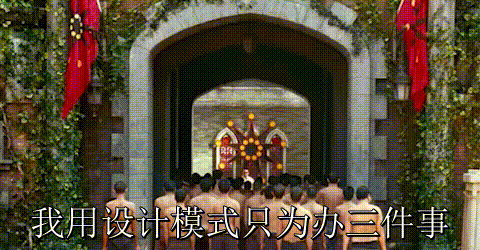

# 设计模式
---
##### 写在前面
在设计模式的分类中，将常见的设计模式分为创建型，结构型，行为型，和Sun公司规定的J2EE型。但这种分类模式多注重于按照实现方式分类，而我在理解设计模式时更加喜欢用模式的设计思想进行分类，如果有任何不同见解欢迎与我进行讨论或上传自己对设计模式的理解。

---
#### 我们为什么要用设计模式？
- 相信很多初学者和我一样，在初识设计模式的时候最大的一个疑惑就是，我为什么要用设计模式？因为在对技术进行初学的时候多为个人开发且项目的复杂程度有限，完全达不到采用设计模式的程度，就会产生一种感觉，就是明明可以直接解决的问题，偏偏要转个弯去解决，然而解决了之后实现的效果完全没有差别，从而产生了设计模式看起来很多余的想法。
但为何设计模式如此重要，归根结底就是两个字，解耦。

- 设计模式我个人的理解来看不是一种实现过程，例如多线程并发解决方案中goroutine的应用，类型转换中反射的应用，反之设计模式更偏向于一种解决问题的思想，是一种抽象化的概念。就好比汽车修理厂中，修理的工具和修理的方法是不同的。工具就是工具不会变，学徒工或是几十年的老师傅手中的钳子扳手也不会变成锤子斧子。但方法不同，或是说手法，在于对整个构造的理解和问题解决方面的多样性和经验，就是能力高低的区别。
- 对于程序设计也一样，举个简单的例子，在做数学题的时候对于一道题，用最简单的办法，提起笔硬加减乘除，只要时间够精力充足，结果的运算可以拓展到无限大，而怎么方便快捷且通用的做出一系列的题目，就是方法所带来的。
- 对于程序来说也一样，设计模式对于一系列的问题给出了一个通用化的解决方案，同时这种解决方案对于程序带来的直接受益就是大大的降低耦合度，设计模式旨在让程序之间互相的耦合度降低，将功能实现与实际运用尽可能分离，从而实现对于拓展、调用、多人协作问题的合理化和便捷化。前面已经提到过了设计模式是一种注重思想而非实现的东西，大家在看所有的设计模式的教程时，不要和直接实现对比我为什么要这么做，而是将关注点放在如果我这么做了会怎样，就会对设计模式有一个不同的理解。

---
#### 常用设计模式
以下均为主观分类，将看起来流程很相似但是本质不同的设计模式分为相同类别

---
1. 不同的类具有相同方法但实现方式又不同时
	- 工厂模式
	  顾名思义，工厂模式的思想在于将一系列具有相同功能的东西通过同一个入口进行创建。就像之前想要造车要去车厂，造船要去船厂，造飞机要去飞机厂，因为他们存在通性，都可以移动，所以现在我们创建了一个叫做可移动交通工具建造厂，这时候用户只需要来到来到交通工具建造厂，并告诉建造厂想要的交通工具名称，即可得到对应的东西了。这样的话就在需要不同的东西的时候不用到不同的地方获取。但工厂模式中的对象一定要有共性，有通用功能，用技术的语言讲就是实现了相同的接口。
	  
	
	- 外观模式
	  外观模式的实现流程上和工厂模式很像，都是将多个类绑定在一个入口类里面，外部通过调用入口类实现功能。但看起来很像却本质完全不同，工厂模式注重于通过不同的名字对不同的类做实例化，而外观模式则是注重于对不同的类的方法进行调用。换句话来说工厂模式是调用工厂时进行判定并实例化，而外观模式是在外观中进行对象实例化，向外部展示的是实例化后的类对应的方法。用现实生活中的抽象理解就是，如果你去工厂要一辆自行车，这辆自行车还只有概念没有实物，需要工厂创建一个实物给你。而如果你能够看到一辆自行车的外观，前提是这辆自行车已经存在了，你看到的是已经存在的实物反映出来的属性。这就是工厂和外观的区别。
	  
	
	- 抽象工厂模式
	  抽象工厂模式可以理解为工厂模式的拓展版，或理解为创造工厂的工厂。抽象出的现实生活场景可以理解为走进一个大工厂，工厂叫做交通工具厂，然后说我要做汽车，之后就走进汽车部，之后说我要做汽车的轮子，就走进轮子组，最后的结果是做出一个汽车轮子。这种交通工具厂->汽车站->轮子组的结构模式中，交通工具厂就是一个抽象工厂。
	
	
	- 策略模式
	  策略模式是针对同一种操作用不同的解决或呈现方式。首先会有一个实体和一些策略，将不同的策略传入实体，实体使用策略后针对具体操作显示不同的效果。比方说人就是实体，操作是处理两个数，策略是加减乘除四种策略，首先在计算开始的时候要进行策略选择，选择使用哪种算法进行运算，选择的运算策略不同会对相同的两个数字显示出不同的效果。
	  
	  
	- 空对象模式
	  空对象模式与工厂模式有一些类似，但是在原有工厂模式的基础上创建了空对象类，在外部调用的参数无法进行匹配时，默认返回一个空对象。类似switch-case语句中的default的作用。
	  
	  
	- 过滤器模式
	  过滤器模式就像一堆漏斗，每一个漏斗对应一种过滤规则，比方说对一杯油水混合的液体，有两个漏斗，一个只能漏过油，一个只能漏过水，那么这杯液体通过不同的漏斗就会得到不同的结果，而至于过滤什么放过什么就是过滤器类所考虑的事情了。所有的过滤器过滤规则不同，但相同的是都有过滤方法，有一种外观模式的味道。
	  
	
2. 实例化对象时添加缓存
	- 单例模式
	  单例模式的核心思想就是一个类只有一个对象，做法就是将构造函数设为私有，这样就能保证类不会被实例化。同时在内部设置一个对外可见的方法用来实例化对象，在实例化的时候先进行检查对象是否已经实例化，如果已经实例化则调用缓存，如果没实例化则实例化。
	  
	  
	- 原型模式
	  原型模式也会做缓存，但返回的时候却不是返回缓存对象，而是返回一个缓存对象的克隆对象，并且使用原型模式不像单例模式直接缓存在类内，会有一个原型类专门进行实例化、缓存还有克隆操作，这样就逃脱了本身类构造函数的束缚，对类的实例化形式会变得多种多样，依情况而定。
	  
	  
	- 备忘录模式
	  上两种方式都是为了解决内存问题，因为实例化某些复杂对象的时候是非常耗时耗资源的，并且操作是重复无意义的，所以要尽量少做实例化操作而把实例化后的对象充分利用。备忘录模式则不同，目的在于记录一系列操作时对象的不同状态，方便与进行回滚等操作，就好像给一套流程中每一步产生的对象加上了一个类似git中的commitid一样的东西，便于外部对于一套流程中的每一步不同状态的对象进行调用切换等操作。
	  
	  
	- 享元模式
	  享元模式关键点在于共享，给定一个共同点，依据共同点来共享对象，其他属性可以不同，求同的同时存异。比方说对于创建一个圆形来说，虽然直径，颜色等都可能不同，但是不管其他属性怎么变，形状都不会变，都依然是圆形。所以在这种情况下，可以将圆形类对象进行缓存，在实例化对象的时候检查是否有缓存，有的话直接取缓存，取到圆形对象之后再设置对应的直径，颜色等属性。如果形状很多，比如正方形，圆形，长方形，那么就用一个list来缓存。
	  

3. 将一个复杂的东西拆分成简单的小块
	- 建造者模式
	  建造者模式旨在将一个复杂的对象的创建过程拆分成N个小对象的创建，这种对象的创建方式在业务流程中是一种非常好的创建流程。在建造者模式中有两个名词，一个是建造者，指的就是N个小类，他们负责创建和提供各种实例，另一个就是导演，顾名思义导演负责分配管理这些小对象创造出的实例，最终把他们建造成一个大对象。
	  举个简单的例子，我们到肯德基去买快餐，各种食物如鸡翅，薯条，汉堡就是一个个建造者，他们能创造出鸡翅，薯条，汉堡的实例，而点餐员就是导演，负责调配这些事务，而你是一个用户，你直接和导演进行交互，告诉导演你要什么，比方说你要A套餐，A套餐里面是汉堡薯条可乐，导演中就会有一个方法是创建一个汉堡实例，一个薯条实例，一个可乐实例最后以一套食物的形式交给你。这就是与建造者模式思想相同的真实应用场景。
	  
	  
	- 模板模式
	  模板模式重点在于对一套复杂流程的模块化，但只是流程模块化而不是功能模块化，也就是说一场游戏，可以分成初始化，开始，结束三个部分，但只是定义了流程，具体初始化，开始，结束这三个功能要在实体类具体是闲的时候进行重定义填入具体业务需求，但变的是功能，不变的是模板，可能实现的效果都完全不同，但不会脱离模板类的流程。
	  
	
4. 对功能做拓展
	- 适配器模式
	  最简单的解释适配器的方式就是最常用的转接头，比方说双项转三项插座，双项插座不能插三项插头，但是如果一定要在这个插座上插三项插头那就需要一个转换器，这个转换器提供给了双项插座适配三项插头的能力。在程序世界的实现里，我们采用一个适配器类，在实体类实例化的时候同时实例化适配器类，这样实体类的功能和适配器类的功能都能被实体类对象调用，从而达到适配的效果。可以将适配器理解成实体类的DLC。
	  

5. 将功能实现与对象创建分离
	- 桥接模式
	  桥接模式是将对象的对象的功能分离，中间用一个借口进行关联的设计模式。可以分为抽象层，功能层，和桥接接口。抽象层初始化桥接接口，功能层实现桥接接口，这样对于外部显示的是一个有功能的类，但内部是分离的。这种方式有一点肉体和灵魂的意味。对于你这个人内部，肉体是肉体，灵魂是灵魂，肉体是你对外部表现的样子，灵魂是你自身在肉体中的，只有肉体只是个空壳没有任何能力，只有灵魂虽然有能力，但是没有载体进行表现。所以对外部是一个有灵魂（功能层）的人（抽象层），通过一个有血有肉的骨架（桥接接口）将二者结合在一起。
	  
	  
	- 装饰器模式
	  装饰器模式和他的名字一样，他是起装饰作用，虽然也是实体与功能分离，但是这里的功能有一种附加功能的感觉，像是考试中的附加分的味道。桥接模式中是将实体的功能和实体的抽象表示完全分离，是对于对象和功能的分离，而装饰器则是对现有对象和额外拓展功能的分离。换句能听懂的话说就是如果说桥接模式是肉体和灵魂的分离，那么装饰器模式就是人和衣服、化妆品的分离。不装饰人依然是个人，装饰了之后人的本质也不会变。这样能类比到程序实现中，在装饰器模式中的实体类是可以被单独调用的，也可以通过装饰类装饰后再进行调用。也就是说如果你要实例化的是一幅画，那么直接实例化也可以，用画框裱好了之后再实例化也可以。
	  
	  
	- 代理模式
	  严格讲代理模式的思想不是为了将功能和实体分离，而是在直接访问对象不太合适的时候，要用一个代理类来进行访问，比方说有一些安全限制等问题，需要进行二次封装方便外界访问。所以他的本质是二次封装而不是将功能和实体分离，实际并没有分离，但是对于外界还是隐藏了实际的功能，虽然访问的效果相同，但是外界只能访问到代理类，而访问不到实体类。最直接的例子就是windows里面的快捷方式，就是一种代理的模式。
	  
	  
	- 命令模式
	  在一个系统中做一些常用的操作时，我们就需要把一个功能进行封装调用，而不是频繁的复写代码，将一个功能分离而不是将其频繁的写在代码中是一种好的解决办法。就像在linux操作系统中，将复杂的安装，操作等封装成一个命令配合一个参数。代替繁杂的代码。
	  
	  
	- 解释器模式
	  解释器模式和命令模式有些类似，命令模式是封装一个操作，而解释器模式则是封装一个语句或一个表达式，比方说进行一个字符串逻辑与，逻辑或，异或操作的时候，将其进行封装进行调用。用方法进行封装能够让逻辑更清晰代码可读性更高。
	  
	  
	- 中介者模式
	  中介者模式通过中介类实现了多类通信的松耦合，相当于在之前想要打电话，想要打给谁必须有一条将两个人的电话连在一起的电话线，这样在通话人数增多时会成复杂度会成指数级增长，因此有了转接台，每个人的电话只需要一根电话线连到转接台，再由接线员将二者连接即可完成通话，这里的转接台和接线员就相当于中介类，实现了两个类之间的解耦。
	  
	  
	- 状态模式
	  状态模式分状态类和设置状态类，状态类中定义状态对应的效果，设置状态类负责将对应的状态设置到对象上。外部实例化状态类，并通过设置状态类进行状态设置，随后可以将状态添加到对象上，同一个对象对于不同的状态会有不同的效果。比方说运动员比赛会有正常发挥，超常发挥，失常发挥等状态，状态会直接带来运动员不同的行为表现。
	  
	
6. 层级嵌套式实现父子级形式结构
	- 组合模式
	  组合模式中在创建时会定义一个变量作为“子类”的承载者，这里子类打引号是因为是组合模式的原因，他们在逻辑上处在一种父子级的状态，但是他们的对象属性方法完全相同，并不存在实际类上面的继承关系。打个比方，一个类里面有名称，年龄，岗位名称，下属员工四个属性，那么董事长下属员工是总经理，总经理下属员工是部门经理，他们在逻辑上用下属员工自选形成嵌套父子级形式，但是他们如果单独拿出来作为一个对象来看他们都是同一个类实例化出来的东西，不存在继承关系。
	  
	  
	- 责任链模式
	  责任链模式和组合模式在结构上有一点相像，也是层级结构，但是组合模式是通过嵌套结构实现对象的嵌套，而责任链则是对象对应的功能。如果说组合模式嵌套的是CEO->总经理->部门经理，那么责任链嵌套的就是职责对应的功能，比方说签字，一个文件按照重要程度决定几级领导需要签字，就是责任链，一个很重要的文件，需要所有领导签字，那么责任链就深入到最低一层，如果不是很重要而且是公司级别的，只需要CEO签字，那么责任链就到CEO一层，其他层级无责任进行签字。或者说是直观的例子就是三国杀中当任意一个人打出一张锦囊牌后，都会从他身边开始请求无懈可击请求一圈，也就是说每个人都有出无懈可击的责任，但是对于这个责任可以选择出或者不出，但是不是大家同时请求，而是按顺序，说明请求有先后顺序而非大家完全平级请求。
	  
	  
	- 迭代器模式
	  在遍历一个具有嵌套结构的对象时会用到，在组合模式和责任链模式中，都是将这种嵌套结构暴露给外部，需要外部根据需求进行调用，而迭代器模式则是创建一个迭代器类，将实体类中的嵌套结构遍历好后直接返回一个迭代好的对象给外部。由此可知，在迭代器模式下，一个聚合类一定存在一个与之对应的迭代器。
	  
	  
	- 访问者模式
	  将访问行为与实际数据相分离，数据不对行为影响，行为也不对数据影响，只有最终的效果在二者结合后呈现出不同的效果。比方说一个人让你做自我介绍，那么你说出去的自身的属性就是这里的数据，那么这些你说出来的事情呗对方听到后对你的印象是基于他的主观判断。而他的主观判断不会对你的自身属性有影响，你的属性也不会影响他判断人的方式，但是你的属性结合他的判断方式，会最终得出一个结论，也就是最终效果，这就是访问者模式。
	  
	
7. 逻辑耦合代码分离
	- 观察者模式
	  观察者模式是一种通知触发机制，在一个类对象产生变化的时候要通过触发机制去改变其他类对象。比方说如果开一家饭店，牛肉涨价了，那么店里的用牛肉的菜都要跟着涨价。那么牛肉就是被观察者，各种菜就是观察者。那么就需要在牛肉类中绑定所有用牛肉的菜，并且建立触发方法，在牛肉的价格改变的时候，触发对应的改价方法，将绑定的所有菜的菜价做修改。这种方式能够降低代码的耦合度，但是在抽象层面食材和菜还是耦合的。
	  